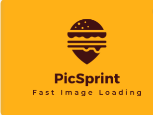
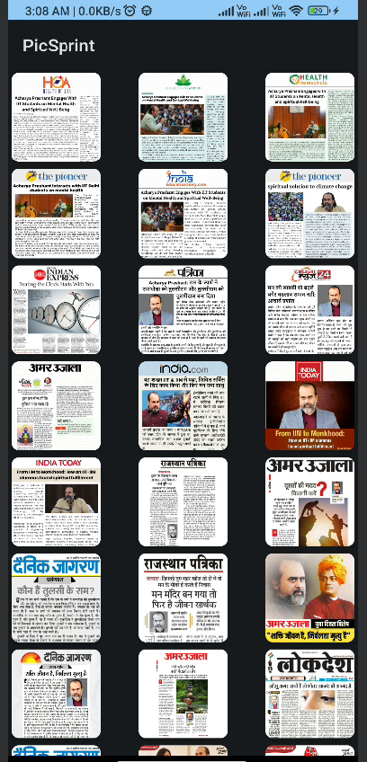

# PicSprint


PicSprint is a sample Android application built using clean code architecture, Dagger, MVVM architecture pattern, Hilt for dependency injection, Retrofit for networking, and Jetpack Compose for UI.



## Project Structure

The project structure follows the clean architecture principles, separating concerns into layers:

- **app**: Contains the main Android application module.
- **data**: Handles data operations such as accessing local and remote data sources.
- **domain**: Defines the business logic and use cases of the application.
- **presentation**: Implements the user interface and presentation logic using Jetpack Compose.

## Features

- Displays a grid of images fetched from a remote API.
- Implements a clean architecture with MVVM pattern.
- Utilizes Dagger and Hilt for dependency injection.
- Uses Retrofit for network operations.
- UI implemented using Jetpack Compose for a modern, declarative approach.

## Setup

1. Clone the repository:

    ```bash
    git clone https://github.com/yourusername/picsprint.git
    ```

2. Open the project in Android Studio.

3. Build and run the project on an Android device or emulator.

## Libraries Used

- [Dagger](https://github.com/google/dagger): Dependency injection framework.
- [Hilt](https://developer.android.com/training/dependency-injection/hilt-android): Dependency injection framework built on top of Dagger.
- [Retrofit](https://square.github.io/retrofit/): Type-safe HTTP client for Android and Java.
- [Jetpack Compose](https://developer.android.com/jetpack/compose): Modern UI toolkit for building native Android UI.
- Add other libraries as needed.

## Contributing

Contributions are welcome! Please follow the [contribution guidelines](CONTRIBUTING.md) before submitting pull requests.

## License

This project is licensed under the MIT License - see the [LICENSE](LICENSE) file for details.
